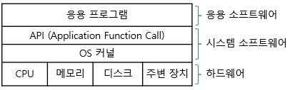

# 컴퓨터 구조

### 1. 컴퓨터
    
    - 폰 노이만 구조 
        ㅇ 프로그램,데이터가 모두 하나의 기억장소(메모리)에 있음
            - 즉, 1차원적으로 서로 혼재되어 저장됨

        ㅇ 프로그램 내장 방식 / 축적 프로그램 방식 (Stored Program)
            - 수행할 프로그램을 기억장치에 저장시켜두고,
            - 개별 명령어들을 순서대로 가져와서,
            - 별도의 중앙처리장치에서 이를 실행하는 방식
            - 컴퓨터 입장에서는 프로그램(연산 절차)도 데이터 처럼 저장하고 처리 가능함
                . 즉, 숫자 같은 형태의 명령어를 사용케됨

        ㅇ CPU와 메모리가 서로 분리됨
            - 연산의 입력 및 결과가 CPU와 메모리 간에 전달됨

        ㅇ SIMD (Single Instruction Multiple Data)
            - 한 번에 하나의 명령어 만을 수행하며,
            - 각 명령어는 몇 개의 데이터들을 동시에 사용함

        ㅇ 폰노이만구조가 프로그래밍 언어와 관련된 특징
            - 변수   : 기억장소의 특정 부분과 관련시킬 수 있음
            - 배정문 : CPU와 기억장소 간의 데이터 이동 연산과 관련됨
            - 반복문 : 반복되는 부분이 기억장소 특정 장소에 인접하여 저장됨

        ㅇ 데이터 버스와 주소 버스를 모두 갖는 구조

        ㅇ 기계적인 2단계 실행 방식 : fetch - execute cycle
            - 데이터를 메모리에서 가져(fetch)와서, 실행(execute)시킴

        ㅇ 현대 컴퓨터 거의 대부분에서 이 방법을 사용
            - 하나의 메모리에 만 접근하기 때문에 단순함

        ㅇ 명령을 읽는 중에 데이터이 접근 불가능하여, CPU 동작이 비효율적이지만,
            - 컴퓨터 버스에 사용되는 신호선 수가 적어 회로 크기의 최소화 구현(저렴)이 용이
    - 하버드 구조 (Harvard Architecture)

        ㅇ 폰 노이만 구조와 거의 동일하나,
            - 프로그램과 데이터가 각각 다르게 분리되어 취급됨

        ㅇ 즉, 프로그램 명령어와 데이터가 다른 비트 수 기반을 갖을 수 있으며, 
            - 다른 메모리(프로그램 메모리,데이터 메모리)에서 취급됨
            - 통상, 소형 기기(스마트폰 등)에서, 
                . 프로그램 메모리 => 플래시 메모리 사용
                . 데이터 메모리 => SRAM 사용

        ㅇ 명령어,데이터 접근에 서로 다른 버스를 사용하므로, 병렬 동시 처리(파이프라이닝 등) 가능하여, 
            - 속도 등에 효율적이지만, 회로 크기 및 구조 복잡

### 2. 중앙처리장치 CPU( Central Processing Unit )
    1. ( 프로세서 = CPU ) - 정보를 처리하는 요소/장치 ( 마이크로프로세서, 멀티프로세서, GPU, 마이크로 컨트롤러 등등)
    2. 역할 : 전송, 연산, 제어
    3. 구성 : ALU (Arithmetic Logic Unit, 산술연산 장치), CU (Control Unit, 제어 장치), 레지스터, 캐시
    4. 종류 :  

| 특징            | CISC (Complex Instruction Set Computer)              | RISC (Reduced Instruction Set Computer)               |
|-----------------|------------------------------------------------------|-------------------------------------------------------|
| 명령어 집합      | 복잡하고 다양한 명령어 집합                          | 최소화된 단순한 명령어 집합                           |
| 하드웨어         | 하드웨어 복잡도가 높음                               | 하드웨어가 단순함                                     |
| 실행 속도        | 상대적으로 느림                                      | 빠름                                                  |
| 프로그래밍       | 비교적 간단                                          | 더 많은 수의 명령어가 필요할 수 있음                    |
| 명령어 형식      | 가변 길이 형식                                       | 고정 길이 형식                                        |
| 코드 크기        | 코드 크기가 작음                                     | 코드 크기가 클 수 있음                                |

### 3. ALU (Arithmetic Logic Unit)
    - CPU 내 연산 수행 장치

### 4. 제어 장치 
    - 명령어, 데이터의 입출력과 ALU의 동작 제어

### 5. 내부 레지스터
    - 메모리와 유사하나, 훨씬 빠른 소규모 저장장치를 주로 의미
    - CPU 내 임시 저장장치로써, CPU 또는 MPU에 내장되어 있음
    - 명령 주소 데이터를 CPU 내에 임시 보관하는 고속의 기억장치임
    - 구분 : 
        1. 범용 레지스터(범용 레지스터, 누산기(Accmulator))
        2. 용도 지정 레지스터
            - 프로그램 카운터 (Program Counter) : 명령어 주소를 임시 저장하는 레지스터
            - 명령어 레지스터 (Instruction Register) : 가장 최근에 인출된 명령어를 임시 저장하는 레지스터
            - 데이터 레지스터 (Data Register) : 데이터 버스에 데이터를 읽고 쓰기 위해 잠시 저장해두는 버퍼 레지스터
            - 주소 레지스터 (Address Register) : 주소 버스에 주소를 출력하기 전에 임시 저장하는 레지스터
            - 프로그램 상태 레지스터 (Program Status Register) : CPU 현재 상태, ALU 연산 결과, 인터럽트 제어, 모드 전환 등 상태를 비트 형식으로 표시
            - 입출력 레지스터 (I/O Register) : 주변장치와 CPU 간에 데이터 전송/중개 전담

### 6. 파이프라인 (Pipeline)
    - 한 단계의 출력 결과물이 다음 단계의 입력으로 사용되는 일련의 데이터 처리 구조
    - 하나의 명령어를 여러 단계로 나누어서 실행하는 방식

### 7. 그래픽 프로세서 (Graphic Process Unit)
    - CPU 부담을 줄이기 위해, 그래픽 데이터 등을 전문적으로 처리하는 보조 프로세서
    - 대량 병렬 프로세서, 여러 스레드를 병렬로 실행 가능

   

### 1. 기억장치 ( 메모리 )
    - 전자적 수단에 의해 기억 및 기록 능력을 실현시키는 장치
    - 2진 정보의 읽기/쓰기/검색이 가능한 다수의 메모리 셀로 구성된 디지털시스템

        1. 캐쉬 메모리 (Cache Memory)
            - CPU와 주 기억장치 등 간에 속도 최적화, 임시 기억 등을 위한 고속의 메모리
        2. 주기억장치
            - 주로 반도체 메모리 소자를 말함(RAM, ROM)
        3. 보조 기억장치 (Auxiliary Memory), 대용량 메모리(Mass Memory), 외부 기억장치(External Memory)
            - 대용량 정보를 저장하기 위한 자기 디스크, 플래시 메모리, 광디스크 등과 같은 저장장치
        4. 가상 메모리(Virtual Memory)
            -  부족한 주기억장치를 보조기억장치로 확장

        > 메모리 관리
            CPU -> Cache Memory -> 주메모리 -> 보조메모리
            -->방향일수록 느려지고, 저가, 큰용량, 큰 에너지 소비
            1. 캐시 (Cache)
                - CPU와 주기억장치 사이에 존재하는 버퍼 형태의 고속의 기억장치
                - CPU에서 메모리로부터 레지스터로 데이터를 읽어들일 때, 캐시라인이란 단위의 데이터를 읽고 해당 데이터를 레지스터로 옮김
                - CPU와 주기억장치 사이의 속도의 차이를 완화시킴

            >   캐싱 알고리즘 종류
                1. LFU (Least Frequently Used) - 캐시 내 가장 덜 찾는 항목 먼저 삭제
                2. LRU (Least Recently Used) - 캐시 내 가장 오래된 항목 먼저 삭제
            
            >   캐시 메모리 종류
                1. L1 cache(Primary cache) - 프로세서 core에 내장된 cache 메모리
                2. 프로세서 안에 내장된 것이 아니라 메인보드나 카트리지에게 장착
        5. 연관 기억장치 (Content Addressable Memory)
            - 정보가 저장되어 있는 주소에 의해 그 내용에 접근함
            - 주소를 사용하는 것이 아닌 계산한 결과로부터 주소를 만들어 저장되어 있는 기억 장치로 접근함
        
        6. 메모리 관리 장치(Memory Management Unit)
            - 가상 메모리 시스템을 관리하는 하드웨어 요소
            - 가상 주소를 실제 물리 주소로 변환
            - 캐시 메모리 관리
            - 버스 중재

        7. 런타임 메모리 
            - 메모리 내 데이터를 일시적으로 기억해두는 영역
            런타임 메모리 or 프로세스 메모리의 할당영역 구분
            1. 정적 영역
                - 영구 메모리 (Permanent)
                    . 텍스트 영역
                    . 데이터 영역 (전역 변수, 정적 변수)
            2. 동적 영역
                - 스택 메모리 (Stack Memory)
                    . 지역 변수, 함수 호출, 함수 매개 변수
                    . 주소 공간 상 높은 주소(bottom)에서 낮은 주소(top)로 할당 됨
                - 힙 메모리 (Heap Memory)
                    . 주소 공간 상에서, 위쪽으로 확장됨
                    . 어플리케이션이 운영체제로부터 미리 할당 받는 메모리 영역

        8. RAM (Random Access Memory)
            - 순차접근방식이 아닌 컴퓨터 주기억장치
            - 컴퓨터 전원이 꺼지면 내용이 사라지는 휘발성 메모리 ( ROM 은 사라지지 않음 )
            종류 
                1. DRAM ( Dynamic RAM ) - 가격저렴, 회로 간단, 속도가 느림
                2. SRAM ( Static RAM ) - 고가, 회로복잡, 속도가 빠름(L2캐시에 사용)
                3. NVRAM (Non-volatile RAM) - 비휘발성 SRAM
                     - SIMM RAM
                        . 단면 커넥터 방식
                    - DIMM RAM (dual in-line memory module) (★)
                        . 양면 커넥터 방식 (64 비트 이상 PC 메모리는 모두 DIMM 방식)
                        . 칩 전면,후면 핀 수는 같으나, 그 기능은 달리함

        9. ROM (Read Only Memory)
            - DRAM과는 달리 일단 기억된 내용은 전원의 공급이 없어도 계속 기억하는 메모리
            종류
                1. Mask ROM : 수정 불가능, 많은 양의 동일한 형태가 필요한 경우
                2. PROM : 다시 수정 가능
                    - EPROM ( Electrically Programmable Read Only Memory) - PROM의 변형, IC위쪽에 특별한 창을 통해 자외선을 비추어 사용
                    - EEPROM (E제곱 PROM) - 회로 기판 상에 붙혀진 상태에서 내용의 일부분을 전기적으로 재수정 가능
                    - FLASH EEPROM (FLASH MEMORY) - 내용 전체를 지우거나 재수정함
        
### 2. 버스
    1. 버스(Bus)
        - 데이터 교환을 위한 신호선들의 묶음
        버스 종류
        1. 통신 선 가닥수에 따른 구분 : 병렬, 직렬 버스
        2. 공통 클럭 여부에 따른 구분 : 동기식 버스, 비동기식 버스
        3. 컴퓨터 내 버스
            - 구조 상의 위치에 따른 구분 : 시스템 버스, I/O 버스
            - 전달 정보에 따른 구분 : 데이터 버스, 주소 버스, 제어 버스
    2. 버스 통신 (Bus Communication)
        - 공유된 신호선들을 사용
        - 다수 노드 간에 데이터 송수신이 가능
        - 다양한 연결 방식의 네트워킹이 가능
        - 통상, 표준화된 프로토콜이 사용됨
    
    3. 컴퓨터 버스 
        - 컴퓨터 메인보드 내 프로세서, 메모리, 주변장치들을 서로 연결하여, 시스템이 원활하게 가동되도록, 데이터 전송 역할을 하는 공통의 통로
        - 통상, 범용의 컴퓨터 시스템은 1 이상의 CPU와 공유 메모리 사이에서 공통 버스를 통해 연결된 여러 장치 컨트롤러들로 구성됨
        종류 
        1. 내부 버스- CPU 내 레지스터 간을 연결
        2. 외부 버스 - 구조상 구분(시스템버스, I/O버스) 신호상 구분 (데이터,주소,제어버스)

    4. 시스템 버스 (데이터버스(양방향), 주소버스(단방향), 제어버스)
        - CPU와 North Bridge 칩셋 간의 데이터 통로
    5. 메모리 버스
        - 노스브리지 메모리 슬롯 사이를 연결하는 통로 역할
    7. I/O 버스 - PCI 버스(CPU 보드와 외부 입출력 장치 간의 데이터 전달용 버스)
    8. 그래픽 버스 - AGP 버스 
    9. 칩셋 버스 - 노스브리지(CPU, RAM, BIOS, GPU, 사우스 브리지)
    
